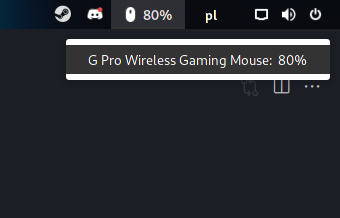

# wireless-hid

This extension is forked from https://github.com/vchlum/wireless-hid. I restructured project a bit and changed some metadata so that I can make my version that will match my needs more but I left `"original-author": "chlumskyvaclav@gmail.com",` in metadata to credit the author since I will make small changes, nothing major. Actually I dont think it can be still considered a fork because I changed project structure so much that fetching an upstream would be a nightmare so I chenged this from fork to regular repository since I am not going to fetch any potential changes anyway. My refactoring deviation got definitly too far in this case xD.

## Gnome Shell extension

wireless-hid shows the battery of the wireless keyboards, mice, and game controllers in percentage and colors. Multiple devices are supported. This extension is inspired by the Keyboard battery extension on e.g.o.

## Troubleshoot

Experiencing a problem, please check the tool upower -d. If you do not see the data/device with power, this extension will not recognize your device too.

## Developing

-   `scripts/release.sh` - build `.zip` extension file
-   `scripts/install.sh` - installs previously build extension in your gnome shell

At this point you need to reload gnome shell in order to be able to enable this extension. You can either log out and log in or you **alt + F2** and type `r`. After this you can enable extension by `gnome-extensions enable wireless-hid-reloaded@filip.izydorczyk.protonmail.com` or through extensions GUI in gnome.

---

# To do

-   [x] make extension displaing % in tray
-   [ ] add possibility to enable and disable displaing devices in tray
